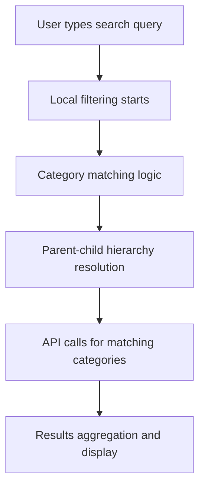

# Search Functionality - APIs Analysis

## 📋 Overview

Complete documentation of all APIs used in the search functionality across the Market Brand application.

---

## 🔍 Primary Search APIs

### 1. **Greeting Templates Search API**

**Service**: `src/services/greetingTemplates.ts`
**Method**: `searchTemplates()`

#### **API Endpoint**
```
GET /api/mobile/greetings/templates?search={query}&language={language}&limit={limit}
```

#### **Usage in Search**
```typescript
// HomeScreen.tsx - Line 2686
const categoryTemplates = await greetingTemplatesService.searchTemplates(category.name);

// PosterPlayerScreen.tsx - Multiple variations
greetingTemplatesService.searchTemplates(greetingCategory, undefined, initialLimit)
greetingTemplatesService.searchTemplates(normalizedCategory, undefined, initialLimit)
```

#### **Parameters**
- `search` (required): Search query string
- `language` (optional): Language filter (english/hindi/all)
- `limit` (optional): Number of results (default: 200)

#### **Response Structure**
```typescript
{
  success: boolean,
  data: {
    templates: GreetingTemplate[] | 
    posters: GreetingTemplate[] | 
    results: GreetingTemplate[] | 
    images: GreetingTemplate[]
  }
}
```

#### **Caching**
- **TTL**: 2 minutes for search results
- **Fast Search**: 5 minutes for previews (limit ≤ 20)
- **Cache Key**: `greeting_search_{query}_{language}_{limit}`

---

### 2. **Business Category Posters API**

**Service**: `src/services/businessCategoryPostersApi.ts`
**Method**: `getPostersByCategory()`

#### **API Endpoint**
```
GET /api/mobile/posters/category/{category}?limit={limit}&categoryId={categoryId}
```

#### **Usage in Search**
```typescript
// HomeScreen.tsx - Line 2699 (Parent-Child Enhancement)
const categoryTemplates = await businessCategoryPostersApi.getPostersByCategory(category.name, 50);

// HomeScreen.tsx - Line 1935 (Category Previews)
const response = await businessCategoryPostersApi.getPostersByCategory(category.name, 200);

// PosterPlayerScreen.tsx - Line 1024
const response = await businessCategoryPostersApi.getPostersByCategory(categoryName, limit);
```

#### **Parameters**
- `category` (required): Category name (URL encoded)
- `limit` (optional): Number of results (default: 200)
- `categoryId` (optional): Category ID for precision
- `isRefresh` (optional): Bypass cache (default: false)

#### **Response Structure**
```typescript
{
  success: boolean,
  data: {
    posters: BusinessCategoryPoster[],
    category: string,
    total: number
  }
}
```

#### **Caching**
- **TTL**: 10 minutes for category posters
- **Cache Key**: `category_{category}`
- **Refresh Support**: `isRefresh` parameter bypasses cache

---

## 🏗️ Supporting APIs (Indirect Search Usage)

### 3. **Business Categories API**

**Service**: `src/services/businessCategoriesService.ts`
**Method**: `getBusinessCategories()`

#### **API Endpoint**
```
GET /api/mobile/business-categories/business
```

#### **Usage in Search Context**
- Provides category hierarchy data for parent-child search
- Returns `parentCategoryName` field for hierarchy resolution
- Used in `getChildCategoriesForParent()` function

#### **Response Structure**
```typescript
{
  success: boolean,
  data: {
    categories: BusinessCategory[]
  }
}
```

#### **Category Interface**
```typescript
interface BusinessCategory {
  id: string;
  name: string;
  parentCategoryName?: string; // Key for hierarchy
  subCategories?: any[];
  // ... other fields
}
```

---

### 4. **Greeting Categories API**

**Service**: `src/services/greetingTemplates.ts`
**Method**: `getGreetingCategories()`

#### **API Endpoint**
```
GET /api/mobile/greetings/categories
```

#### **Usage in Search Context**
- Provides category data for greeting template hierarchy
- Returns `parentCategoryName` field for parent-child relationships
- Used alongside business categories in search logic

#### **Response Structure**
```typescript
{
  success: boolean,
  data: {
    categories: GreetingCategory[]
  }
}
```

---

## 🔗 API Integration Flow in Search

### **Search Execution Flow**



### **API Call Sequence**

#### **1. Initial Local Search** (Immediate)
- No API calls
- Uses cached/pre-loaded data
- Filters existing templates locally

#### **2. Category-Based API Search** (Async, 300ms delay)
```typescript
// For General Categories
allMatchingCategories.map(async (category) => {
  const templates = await greetingTemplatesService.searchTemplates(category.name);
  return templates.map(t => ({ ...t, category: category.name }));
});

// For Business Categories  
allMatchingCategories.map(async (category) => {
  const templates = await businessCategoryPostersApi.getPostersByCategory(category.name, 50);
  return templates.success && templates.data?.posters ? templates.data.posters : [];
});
```

#### **3. Results Processing**
- Combine API results with local results
- Remove duplicates
- Group by category
- Sort by relevance

---

## 📊 API Usage Patterns

### **High-Frequency APIs**
1. **Greeting Templates Search**: Used for every category search
2. **Business Category Posters**: Used for every business category search

### **Medium-Frequency APIs**
1. **Business Categories**: Loaded once per session
2. **Greeting Categories**: Loaded once per session

### **Cache Strategy**
- **Search Results**: Short TTL (2-5 minutes) for freshness
- **Category Data**: Long TTL (10 minutes) for stability
- **Category Posters**: Medium TTL (10 minutes) with refresh support

---

## 🎯 Search-Specific API Features

### **1. Multi-Variant Search**
```typescript
// PosterPlayerScreen.tsx - Search variations
const searchVariations = [
  greetingCategory,           // Original
  normalizedCategory,         // Normalized
  ...wordVariations           // Individual words
];

searchVariations.map(variation => 
  greetingTemplatesService.searchTemplates(variation, undefined, initialLimit)
);
```

### **2. Language Support**
```typescript
// Greeting templates support language filtering
greetingTemplatesService.searchTemplates(query, 'english', limit)
greetingTemplatesService.searchTemplates(query, 'hindi', limit)
greetingTemplatesService.searchTemplates(query, 'all', limit)
```

### **3. Limit Control**
```typescript
// Different limits for different contexts
searchTemplates(query, undefined, 12)    // Fast previews
searchTemplates(query, undefined, 50)    // Category search
searchTemplates(query, undefined, 200)   // Full category load
```

### **4. Category Precision**
```typescript
// Business category API supports both name and ID
getPostersByCategory(categoryName, limit, false, categoryId)
```

---

## 🚨 Search API Dependencies

### **Required for Parent-Child Search**
1. **Business Categories API**: Provides `parentCategoryName` data
2. **Greeting Categories API**: Provides hierarchy for greeting categories
3. **Template Search APIs**: Fetch content for discovered categories

### **Cache Dependencies**
- `cacheService.getOrFetch()` for all search APIs
- Category data must be loaded before hierarchy resolution
- Template data must be available for local filtering

---

## 📈 Performance Considerations

### **API Call Optimization**
- **Debouncing**: 300ms delay prevents excessive calls
- **Batching**: Multiple category searches in parallel
- **Caching**: Aggressive caching for frequently accessed data
- **Limits**: Appropriate limits for different use cases

### **Network Efficiency**
- **Parallel Requests**: Multiple API calls executed simultaneously
- **Conditional Requests**: Only call APIs when categories match
- **Cache Hits**: Prioritize cached data over fresh requests

---

## 🎯 Summary

The search functionality uses **4 primary APIs**:

1. **Greeting Templates Search** - `/api/mobile/greetings/templates`
2. **Business Category Posters** - `/api/mobile/posters/category/{category}`
3. **Business Categories** - `/api/mobile/business-categories/business`
4. **Greeting Categories** - `/api/mobile/greetings/categories`

These APIs work together to provide:
- **Immediate local search** (cached data)
- **Category-based API search** (hierarchical content)
- **Parent-child category inclusion** (enhanced discovery)
- **Multi-variant search** (better matching)

The API architecture supports the current search implementation and the parent-child enhancement through proper category hierarchy data and flexible template fetching.
